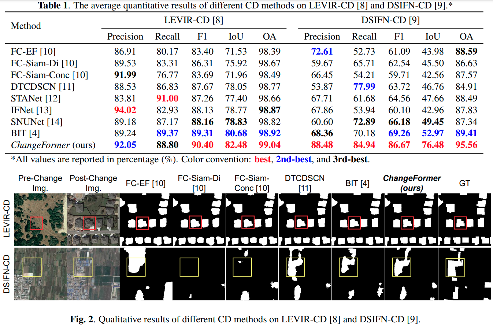

## ChangeFormer: A Transformer-Based Siamese Network for Change Detection
> [A Transformer-Based Siamese Network for Change Detection](https://arxiv.org/abs/2201.01293)

> [Wele Gedara Chaminda Bandara](https://www.wgcban.com/), and [Vishal M. Patel](https://engineering.jhu.edu/vpatel36/sciencex_teams/vishalpatel/)

> Presented at [IGARSS-22](https://www.igarss2022.org/default.php), Kuala Lumpur, Malaysia.

Useful links:
- Paper (published): https://ieeexplore.ieee.org/document/9883686
- Paper (ArXiv): https://arxiv.org/abs/2201.01293
- Presentation (in YouTube): https://www.youtube.com/watch?v=SkiNoTrSmQM

## My other Change Detection repos:

- Change Detection with Denoising Diffusion Probabilistic Models: [DDPM-CD](https://github.com/wgcban/ddpm-cd)
- Semi-supervised Change Detection: [SemiCD](https://github.com/wgcban/SemiCD)
- Unsupervised Change Detection: [Metric-CD](https://github.com/wgcban/Metric-CD)


## Network Architecture


## Quantitative & Qualitative Results on LEVIR-CD and DSIFN-CD


# Usage
## Requirements

```
Python 3.8.0
pytorch 1.10.1
torchvision 0.11.2
einops  0.3.2
```

- Please see `requirements.txt` for all the other requirements.

## Setting up conda environment: 

Create a virtual ``conda`` environment named ``ChangeFormer`` with the following command:

```bash
conda create --name ChangeFormer --file requirements.txt
conda activate ChangeFormer
```

## Installation

Clone this repo:

```shell
git clone https://github.com/wgcban/ChangeFormer.git
cd ChangeFormer
```

## Quick Start on LEVIR dataset

We have some samples from the [LEVIR-CD](https://justchenhao.github.io/LEVIR/) dataset in the folder `samples_LEVIR` for a quick start.

Firstly, you can download our ChangeFormerV6 pretrained model——by [`Github-LEVIR-Pretrained`](https://github.com/wgcban/ChangeFormer/releases/download/v0.1.0/CD_ChangeFormerV6_LEVIR_b16_lr0.0001_adamw_train_test_200_linear_ce_multi_train_True_multi_infer_False_shuffle_AB_False_embed_dim_256.zip). 

Place it in `checkpoints/ChangeFormer_LEVIR/`.

Run a demo to get started as follows:

```python
python demo_LEVIR.py
```

You can find the prediction results in `samples/predict_LEVIR`.


## Quick Start on DSIFN dataset

We have some samples from the [`DSIFN-CD`](https://github.com/GeoZcx/A-deeply-supervised-image-fusion-network-for-change-detection-in-remote-sensing-images/tree/master/dataset) dataset in the folder `samples_DSIFN` for a quick start.

Download our ChangeFormerV6 pretrained model——by [`Github`](https://github.com/wgcban/ChangeFormer/releases/download/v0.1.0/CD_ChangeFormerV6_DSIFN_b16_lr0.00006_adamw_train_test_200_linear_ce_multi_train_True_multi_infer_False_shuffle_AB_False_embed_dim_256.zip). After downloaded the pretrained model, you can put it in `checkpoints/ChangeFormer_DSIFN/`.

Run the demo to get started as follows:

```python
python demo_DSIFN.py
```

You can find the prediction results in `samples/predict_DSIFN`.

## Training on LEVIR-CD

When we initialy train our ChangeFormer, we initialized some parameters of the network with a model pre-trained on the RGB segmentation (ADE 160k dataset) to get faster convergence.

You can download the pre-trained model [`Github-LEVIR-Pretrained`](https://github.com/wgcban/ChangeFormer/releases/download/v0.1.0/CD_ChangeFormerV6_LEVIR_b16_lr0.0001_adamw_train_test_200_linear_ce_multi_train_True_multi_infer_False_shuffle_AB_False_embed_dim_256.zip).
```
wget https://www.dropbox.com/s/undtrlxiz7bkag5/pretrained_changeformer.pt
```

Then, update the path to the pre-trained model by updating the ``path`` argument in the ``run_ChangeFormer_LEVIR.sh``.
Here:
https://github.com/wgcban/ChangeFormer/blob/a3eca2b1ec5d0d2628ea2e0b6beae85630ba79d4/scripts/run_ChangeFormer_LEVIR.sh#L28

You can find the training script `run_ChangeFormer_LEVIR.sh` in the folder `scripts`. You can run the script file by `sh scripts/run_ChangeFormer_LEVIR.sh` in the command environment.

The detailed script file `run_ChangeFormer_LEVIR.sh` is as follows:

```cmd
#!/usr/bin/env bash

#GPUs
gpus=0

#Set paths
checkpoint_root=/media/lidan/ssd2/ChangeFormer/checkpoints
vis_root=/media/lidan/ssd2/ChangeFormer/vis
data_name=LEVIR


img_size=256    
batch_size=16   
lr=0.0001         
max_epochs=200
embed_dim=256

net_G=ChangeFormerV6        #ChangeFormerV6 is the finalized verion

lr_policy=linear
optimizer=adamw                 #Choices: sgd (set lr to 0.01), adam, adamw
loss=ce                         #Choices: ce, fl (Focal Loss), miou
multi_scale_train=True
multi_scale_infer=False
shuffle_AB=False

#Initializing from pretrained weights
pretrain=/media/lidan/ssd2/ChangeFormer/pretrained_segformer/segformer.b2.512x512.ade.160k.pth

#Train and Validation splits
split=train         #train
split_val=test      #test, val
project_name=CD_${net_G}_${data_name}_b${batch_size}_lr${lr}_${optimizer}_${split}_${split_val}_${max_epochs}_${lr_policy}_${loss}_multi_train_${multi_scale_train}_multi_infer_${multi_scale_infer}_shuffle_AB_${shuffle_AB}_embed_dim_${embed_dim}

CUDA_VISIBLE_DEVICES=1 python main_cd.py --img_size ${img_size} --loss ${loss} --checkpoint_root ${checkpoint_root} --vis_root ${vis_root} --lr_policy ${lr_policy} --optimizer ${optimizer} --pretrain ${pretrain} --split ${split} --split_val ${split_val} --net_G ${net_G} --multi_scale_train ${multi_scale_train} --multi_scale_infer ${multi_scale_infer} --gpu_ids ${gpus} --max_epochs ${max_epochs} --project_name ${project_name} --batch_size ${batch_size} --shuffle_AB ${shuffle_AB} --data_name ${data_name}  --lr ${lr} --embed_dim ${embed_dim}
```

## Training on DSIFN-CD

Follow the similar procedure mentioned for LEVIR-CD. Use `run_ChangeFormer_DSIFN.sh` in `scripts` folder to train on DSIFN-CD.

## Evaluate on LEVIR

You can find the evaluation script `eval_ChangeFormer_LEVIR.sh` in the folder `scripts`. You can run the script file by `sh scripts/eval_ChangeFormer_LEVIR.sh` in the command environment.

The detailed script file `eval_ChangeFormer_LEVIR.sh` is as follows:

```cmd
#!/usr/bin/env bash

gpus=0

data_name=LEVIR
net_G=ChangeFormerV6 #This is the best version
split=test
vis_root=/media/lidan/ssd2/ChangeFormer/vis
project_name=CD_ChangeFormerV6_LEVIR_b16_lr0.0001_adamw_train_test_200_linear_ce_multi_train_True_multi_infer_False_shuffle_AB_False_embed_dim_256
checkpoints_root=/media/lidan/ssd2/ChangeFormer/checkpoints
checkpoint_name=best_ckpt.pt
img_size=256
embed_dim=256 #Make sure to change the embedding dim (best and default = 256)

CUDA_VISIBLE_DEVICES=0 python eval_cd.py --split ${split} --net_G ${net_G} --embed_dim ${embed_dim} --img_size ${img_size} --vis_root ${vis_root} --checkpoints_root ${checkpoints_root} --checkpoint_name ${checkpoint_name} --gpu_ids ${gpus} --project_name ${project_name} --data_name ${data_name}
```

## Evaluate on DSIFN

Follow the same evaluation procedure mentioned for LEVIR-CD. You can find the evaluation script `eval_ChangeFormer_DSFIN.sh` in the folder `scripts`. You can run the script file by `sh scripts/eval_ChangeFormer_DSIFN.sh` in the command environment.

### Dataset Preparation

## Data structure

```
Change detection data set with pixel-level binary labels；
├─A
├─B
├─label
└─list
```

`A`: images of t1 phase;

`B`:images of t2 phase;

`label`: label maps;

`list`: contains `train.txt, val.txt and test.txt`, each file records the image names (XXX.png) in the change detection dataset.

## Links to processed datsets used for train/val/test

You can download the processed `LEVIR-CD` and `DSIFN-CD` datasets by the DropBox through the following here:

- LEVIR-CD-256: [`click here to download`](https://www.dropbox.com/s/18fb5jo0npu5evm/LEVIR-CD256.zip)
- DSIFN-CD-256: [`click here to download`](https://www.dropbox.com/s/18fb5jo0npu5evm/LEVIR-CD256.zip)

Since the file sizes are large, I recommed to use command line and cosider downloading the zip file as follows (in linux):

To download LEVIR-CD dataset run following command in linux-terminal:
```cmd
wget https://www.dropbox.com/s/18fb5jo0npu5evm/LEVIR-CD256.zip
```
To download DSIFN-CD dataset run following command in linux-terminal:
```cmd
wget https://www.dropbox.com/s/18fb5jo0npu5evm/LEVIR-CD256.zip
```

For your reference, I have also attached the inks to original LEVIR-CD and DSIFN-CD here: [`LEVIR-CD`](https://justchenhao.github.io/LEVIR/) and [`DSIFN-CD`](https://github.com/GeoZcx/A-deeply-supervised-image-fusion-network-for-change-detection-in-remote-sensing-images/tree/master/dataset).

### Other useful notes
#### ChangeFormer for multi-class change detection
If you wish to use ChangeFormer for multi-class change detection, you will need to make a few modifications to the existing codebase, which is designed for binary change detection. There are many discussions in the issues section. The required modifications are (https://github.com/wgcban/ChangeFormer/issues/93#issuecomment-1918609871):
1. `run_ChangeFormer_cd.sh`: n_class=8 and make it a hyperparameter to python main.py
2. `models/networks.py`: net = ChangeFormerV6(embed_dim=args.embed_dim, output_nc=args.n_class)
3. `models/basic_model.py`: Comment out: pred_vis = pred * 255, i.e., modifications to visualisation processing
4. `models/trainer.py`: Modify: ConfuseMatrixMeter(n_class=self.n_class)

### License

Code is released for non-commercial and research purposes **only**. For commercial purposes, please contact the authors.

### Citation

If you use this code for your research, please cite our paper:

```bibtex
@INPROCEEDINGS{9883686,
  author={Bandara, Wele Gedara Chaminda and Patel, Vishal M.},
  booktitle={IGARSS 2022 - 2022 IEEE International Geoscience and Remote Sensing Symposium}, 
  title={A Transformer-Based Siamese Network for Change Detection}, 
  year={2022},
  volume={},
  number={},
  pages={207-210},
  doi={10.1109/IGARSS46834.2022.9883686}}
```

## Disclaimer
Appreciate the work from the following repositories:
- https://github.com/justchenhao/BIT_CD (Our ChangeFormer is implemented on the code provided in this repository)

