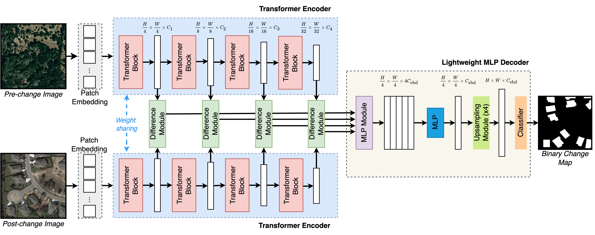

# ChangeFormer: A Transformer Siamese Network for Change Detection

[Wele Gedara Chaminda Bandara](), [Vishal M. Patel]()

Here, we provide the pytorch implementation of the paper: Remote Sensing Image Change Detection with Transformers.

For more ore information, please see our published paper at [IEEE TGRS]() or [arxiv](). 



## Requirements

```
Python 3.6
pytorch 1.6.0
torchvision 0.7.0
einops  0.3.0
```

## Installation

Clone this repo:

```shell
https://github.com/wgcban/ChangeFormer.git
cd ChangeFormer
```

## Quick Start

We have some samples from the [LEVIR-CD](https://justchenhao.github.io/LEVIR/) dataset in the folder `samples` for a quick start.

Firstly, you can download our BIT pretrained model——by [DropBox (no signin required)](https://www.dropbox.com/sh/iwwwv9ta1fnu6e9/AABcSRxt5PUggJPJEXGwUs4-a?dl=0). After downloaded the pretrained model, you can put it in `checkpoints/ChangeFormer_LEVIR/`.

Then, run a demo to get started as follows:

```python
python demo.py 
```

After that, you can find the prediction results in `samples/predict`.

## Train

You can find the training script `run_cd.sh` in the folder `scripts`. You can run the script file by `sh scripts/run_cd.sh` in the command environment.

The detailed script file `run_cd.sh` is as follows:

```cmd
#!/usr/bin/env bash

#GPUs
gpus=0

#Set paths
checkpoint_root=/media/lidan/ssd2/ChangeFormer/checkpoints
vis_root=/media/lidan/ssd2/ChangeFormer/vis
data_name=LEVIR #LEVIR, DSIFN


img_size=256    #Choices=128, 256, 512
batch_size=8    #Choices=8, 16, 32, 64
lr=0.01         
max_epochs=200

net_G=ChangeFormerV5    #Choices=ChangeFormerV1/2/3/4/5

lr_policy=linear
optimizer=sgd           #Choices: sgd, adam
loss=ce                 #Choices: ce, fl (Focal Loss), miou
multi_scale_train=True
multi_scale_infer=False
shuffle_AB=False

#Initializing from pretrained weights
pretrain=/media/lidan/ssd2/ChangeFormer/pretrained_segformer/segformer.b2.512x512.ade.160k.pth

#Train and Validation splits
split=train         #trainval
split_val=test      #test
project_name=CD_${net_G}_${data_name}_b${batch_size}_lr${lr}_${optimizer}_${split}_${split_val}_${max_epochs}_${lr_policy}_${loss}_multi_train_${multi_scale_train}_multi_infer_${multi_scale_infer}_shuffle_AB_${shuffle_AB}_embed_dim_${embed_dim}

CUDA_VISIBLE_DEVICES=0 python main_cd.py --img_size ${img_size} --loss ${loss} --checkpoint_root ${checkpoint_root} --vis_root ${vis_root} --lr_policy ${lr_policy} --optimizer ${optimizer} --pretrain ${pretrain} --split ${split} --split_val ${split_val} --net_G ${net_G} --multi_scale_train ${multi_scale_train} --multi_scale_infer ${multi_scale_infer} --gpu_ids ${gpus} --max_epochs ${max_epochs} --project_name ${project_name} --batch_size ${batch_size} --shuffle_AB ${shuffle_AB} --data_name ${data_name}  --lr ${lr}
```

## Evaluate

You can find the evaluation script `eval.sh` in the folder `scripts`. You can run the script file by `sh scripts/eval.sh` in the command environment.

The detailed script file `eval.sh` is as follows:

```cmd
gpus=0
data_name=LEVIR # dataset name
net_G=base_transformer_pos_s4_dd8_dedim8 # model name 
split=test # test.txt
project_name=BIT_LEVIR # the name of the subfolder in the checkpoints folder 
checkpoint_name=best_ckpt.pt # the name of evaluated model file 

python eval_cd.py --split ${split} --net_G ${net_G} --checkpoint_name ${checkpoint_name} --gpu_ids ${gpus} --project_name ${project_name} --data_name ${data_name}
```

## Dataset Preparation

### Data structure

```
"""
Change detection data set with pixel-level binary labels；
├─A
├─B
├─label
└─list
"""
```

`A`: images of t1 phase;

`B`:images of t2 phase;

`label`: label maps;

`list`: contains `train.txt, val.txt and test.txt`, each file records the image names (XXX.png) in the change detection dataset.

### Data Download 

LEVIR-CD: https://justchenhao.github.io/LEVIR/

WHU-CD: https://study.rsgis.whu.edu.cn/pages/download/building_dataset.html

DSIFN-CD: https://github.com/GeoZcx/A-deeply-supervised-image-fusion-network-for-change-detection-in-remote-sensing-images/tree/master/dataset

## License

Code is released for non-commercial and research purposes **only**. For commercial purposes, please contact the authors.

## Citation

If you use this code for your research, please cite our paper:

```
@Article{chen2021a,
    title={Remote Sensing Image Change Detection with Transformers},
    author={Hao Chen, Zipeng Qi and Zhenwei Shi},
    year={2021},
    journal={IEEE Transactions on Geoscience and Remote Sensing},
    volume={},
    number={},
    pages={1-14},
    doi={10.1109/TGRS.2021.3095166}
}
```

